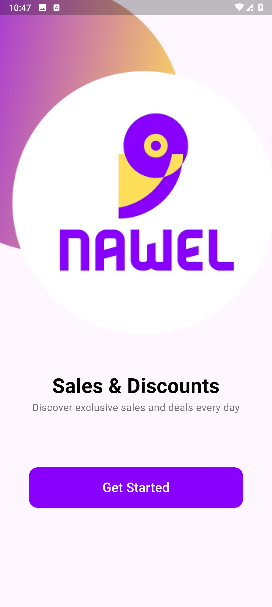
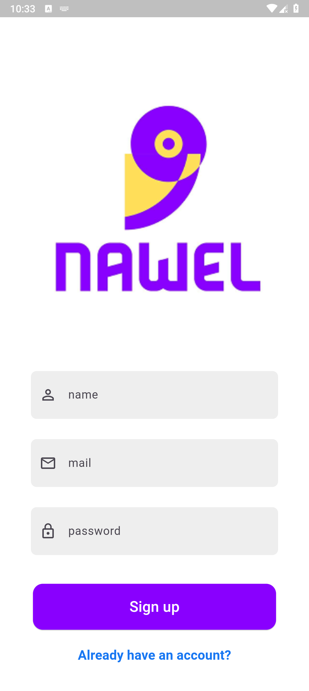
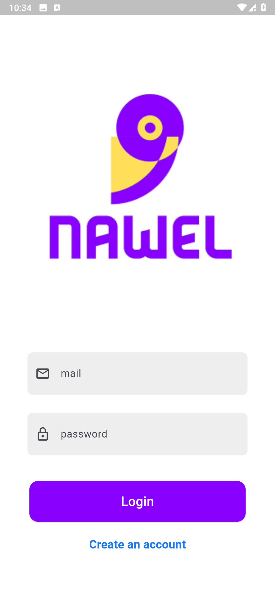
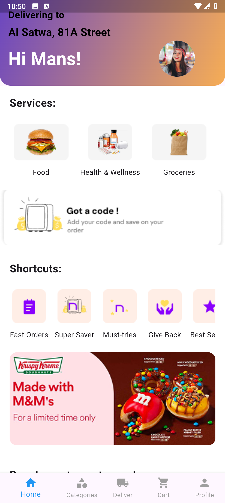

# AUVNET Flutter Internship Assessment

This is a simplified and responsive Flutter e-commerce application built using **Clean Architecture** and **BLoC pattern** as part of the AUVNET internship assessment.

## ✅ Features Implemented

- Onboarding screens with page transitions
- Firebase authentication (login and register)
- Home screen UI design (based on the provided Figma link)

---

## 🚀 Getting Started

### Requirements
- Flutter SDK 3.7.2+
- Dart SDK
- Firebase project (authentication enabled)

### Installation
```bash
# Clone the repository
git clone https://github.com/OmarGamal-MobileApps-developer/AUVNET-Flutter-Internship-Assessment.git

cd auvnet_ecommerce_app
flutter pub get
flutter run
```

---

## 🧱 Architecture Overview

The project follows **Clean Architecture**:

```
lib/
├── core/                  # Theme, helpers, constants
├── features/              # Feature-based structure
│   ├── onboarding/
│   ├── auth/
│   └── home/
│       ├── data/
│       ├── domain/
│       └── presentation/
└── main.dart
```

### State Management
- Managed using `flutter_bloc`
- Each feature has its own bloc, event, and state
- All states are immutable (using `copyWith()`)

---

## 🔗 Firebase Integration
- **Authentication**: Login and Register with email/password
- Uses `firebase_core` and `firebase_auth`

## 💾 Local Storage
- Hive is used to store onboarding completion status
- Configured via `hive` and `hive_flutter`

---

## 🎨 UI/UX
- Responsive UI built with `flutter_screenutil`
- Native splash screen via `flutter_native_splash`
- App launcher icon via `flutter_launcher_icons`

---

## 📸 Screenshots

| Onboarding | Register | Login | Home |
|------------|----------|-------|------|
|  |  |  |  |

> Place your screenshots in the `assets/screenshots/` directory.

---

## 📦 Packages Used

| Package                 | Purpose                        |
|------------------------|--------------------------------|
| flutter_bloc           | State management               |
| equatable              | State comparison               |
| hive / hive_flutter    | Local storage                  |
| firebase_core / auth   | Firebase integration           |
| flutter_screenutil     | Responsive UI                  |
| flutter_native_splash  | Custom splash screen           |
| flutter_launcher_icons | App launcher icon              |
| dartz                  | Functional programming support |
| hive_generator         | Model generator for Hive       |
| build_runner           | Code generation tool           |

---

## 🧹 Code Quality
- Code follows Flutter best practices
- Structured, commented, and easy to maintain
- Uses `flutter_lints` for consistent code style

---

## 📤 Submission Checklist
- ✅ Project uploaded to GitHub repo: `AUVNET-Flutter-Internship-Assessment`
- ✅ Readme file includes setup, structure, and overview

---

## 🗓 Deadline
- Task received: **June 16**
- Deadline: **June 18**

For questions, contact [AhmedRoyale@AUVNET.com](mailto:AhmedRoyale@AUVNET.com)

---

## 🔗 GitHub Link
- [AUVNET Flutter Internship Assessment Repo](https://github.com/OmarGamal-MobileApps-developer/AUVNET-Flutter-Internship-Assessment)

---

> Built with care to reflect clean code, efficient architecture, and professional delivery. ✅
